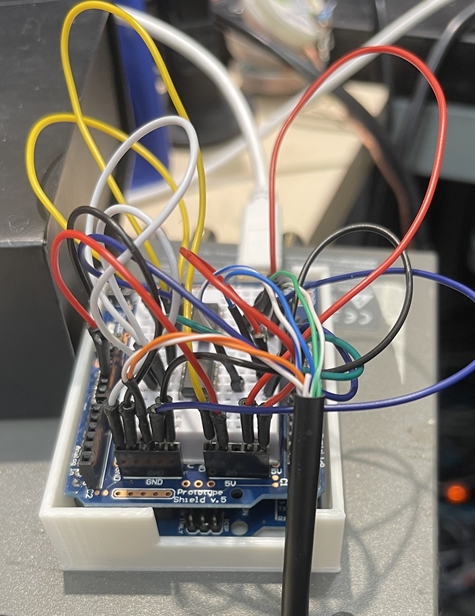

# arduino_cleanswitch_src_distributor

## What I made

I wanted to make Blackmagic Design Smart Videohub CleanSwitch to route one source to all the destinations.

## With What?

Using an Arduino Uno and a breadboard shield.

Looks quite dirty, doesn't it?
